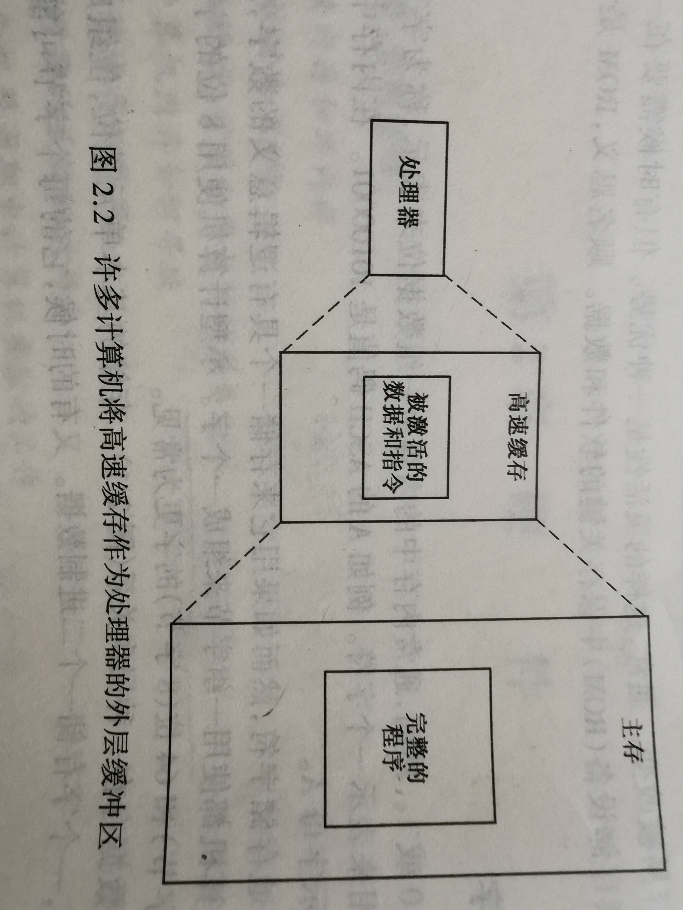

<!--
 * @Description: 
 * @Author: YPY
 * @Date: 2021-11-29 23:02:27
 * @LastEditTime: 2021-11-30 23:20:09
 * @LastEditors: YPY
 * @Reference: 
-->
# 1. 目录
- [1. 目录](#1-%E7%9B%AE%E5%BD%95)
  * [1.1. 引言](#11-%E5%BC%95%E8%A8%80)
    + [1.1.1. 操作系统的定义](#111-%E6%93%8D%E4%BD%9C%E7%B3%BB%E7%BB%9F%E7%9A%84%E5%AE%9A%E4%B9%89)
    + [1.1.2. 操作系统的组成](#112-%E6%93%8D%E4%BD%9C%E7%B3%BB%E7%BB%9F%E7%9A%84%E7%BB%84%E6%88%90)
  * [1.2. 硬件](#12-%E7%A1%AC%E4%BB%B6)
    + [1.2.1. 存储器](#121-%E5%AD%98%E5%82%A8%E5%99%A8)
## 1.1. 引言
### 1.1.1. 操作系统的定义

操作系统是存在于应用程序域硬件之间的系统程序的集合；是计算计算机硬件和软件之间的接口。

### 1.1.2. 操作系统的组成

用户接口（shell):设备管理、文件管理、内存管理、处理器管理  
文件管理，又称文件系统，有时间创建、删除、修改和按名存取文件的一系列程序组成。  
设备管理负责控制系统与外部设备（如键盘、显示器、打印机和辅助存储设备)之间的信息交换。  
处理器管理和内存管理对客户来说是透明的，内存管理负责管理计算机的主存资源，按照需要为应用程序分配空间，并确保各个应用程序之间互不干扰。
处理器管理负责有效得管理处理器的时间。

各个组成部分大家相互协调完成工作。
## 1.2. 硬件
### 1.2.1. 存储器
**计算机主存用来保存当前正在使用的程序和数据。程序在执行前必须装进内存。数据只有存储在内存中才能被计算机使用**
#### 物理存储设备（RAM和ROM）
**RAM**随机存储设备，主存。是与CPU直接交换数据的内部存储器。可以随时读写，速度快，通常作为操作系统或其他正在运行中得程序的临时数据存储媒介。断电不能保存数据。
**ROM**只读存储设备，保存关键的软件和数据。只读，不能重新写入。断电数据不会改变
#### 字节和字
一个0或1称为一位，1bit.
内存中的内容由一组数据位来表示，称为字节或字。字节通常用8位。  
计算机使用一组字节来组成一个字。比如64位（8字节）的字。
位组成字节，字节组成字。
#### 可编制存储器
内存容量一般用兆字节通来度量。byte意为“字节”，是计算机文件大小的基本单位。每个字节（更一般的是每个物理存储单元）都有一个唯一的地址。字节或字是计算机中可寻址的基本单位，处理器与内存之间以它们为单位进行数据交换。  
**字和字节的区别**
这两者应用的场合不同。通常用bit来作数据传输的单位，因为物理层，数据链路层的传输对于用户是透明的，而这种通信传输是基于二进制的传输。在应用层通常是用byte来作单位，表示文件的大小，在用户看来就是可见的数据大小。比如一个字符就是1byte,如果是汉字，则是2byte。
#### 高速缓冲存储器（Cache）
Cache通常作为处理器的外层缓冲区。

### 处理器（CPU）
中央处理器或者主处理器，处理器在程序的控制下，对存储在内存中的数据进行处理。
#### 程序指令
程序是一系列指令的集合。每一条指令有一个操作码和若干个操作数。操作码明确功能，操作数确定参加运算的**数据在内存中的位置**
#### 处理器部件
控制器（ICU）：从内存中取得指令  
运算器（ALU）：包括一些实现加、减、乘等指令（计算机指令集）的逻辑电路，可以执行指令  
寄存器：来暂时存储控制信息、关键数据和运算的中间结果。CPU中至少要有六类寄存器：指令寄存器（IR）、程序计数器（PC）、地址寄存器（AR）、数据寄存器（DR）、累加寄存器（AC）、程序状态字寄存器（PSW）。这些寄存器用来暂存一个计算机字，其数目可以根据需要进行扩充    
时钟：产生精确的电子脉冲，使得其他部件能够同步工作
#### 机器周期
在指令周期，控制器取出指令；在执行周期，运算器执行指令。这两步加起来构成了一个机器周期。
### 微指令（固件）
存在于内存和计算器之间。电脑的BIOS就是一种固件。驱动和固件不一样
固件(Firmware)就是写入EPROM（可擦写可编程只读存储器）或EEPROM(电可擦可编程只读存储器)中的程序。
### 辅存
